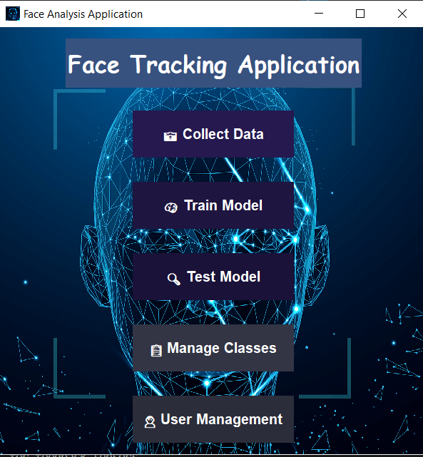

# 😊 Face Tracking for Gesture-Based Interaction

## 📌 Project Overview
This project develops a **Tkinter-based interface** for collecting face landmark data to train a **deep learning model** for detecting head movements and facial gestures. The system enables both head-controlled mouse movement and gesture-based keyboard actions by mapping **four classes (default, enter, space, click)** to real-time interactions. Using MediaPipe for face tracking, the solution provides mouse-free and keyboard-free interaction, with a user-friendly GUI for data collection, model training, testing, class management, and user management.

Face and head-tracking systems enable individuals with severe motor impairments to control a computer using natural movements of their face or head—offering a vital, hands-free alternative to standard input devices like a keyboard or mouse ([arXiv:1109.1454](https://arxiv.org/pdf/1109.1454)).
---

## 📂 Dataset
- **Custom Dataset**: Face landmarks (468 points with x, y, z, visibility) collected via webcam and stored in `coords.csv`.
- Classes: 
  - Default Position (without movement)
  - Enter (head movement for Enter key)
  - Space (head movement for Space key)
  - Click (head movement for mouse click)

---

## 🔍 Project Workflow

### **1. Data Collection**
Capture face landmarks using MediaPipe and save to CSV.

```python
import mediapipe as mp
import cv2
import csv
import numpy as np

def collect_landmarks(class_name, csv_file='coords.csv'):
    cap = cv2.VideoCapture(0)
    with mp.solutions.holistic.Holistic(min_detection_confidence=0.5, min_tracking_confidence=0.5) as holistic:
        while cap.isOpened():
            ret, frame = cap.read()
            image = cv2.cvtColor(frame, cv2.COLOR_BGR2RGB)
            results = holistic.process(image)
            if results.face_landmarks:
                face = results.face_landmarks.landmark
                face_row = list(np.array([[landmark.x, landmark.y, landmark.z, landmark.visibility] 
                                         for landmark in face]).flatten())
                row = [class_name] + face_row
                with open(csv_file, mode='a', newline='') as f:
                    csv_writer = csv.writer(f)
                    csv_writer.writerow(row)
            cv2.imshow('Raw Webcam Feed', image)
            if cv2.waitKey(10) & 0xFF == ord('q'):
                break
    cap.release()
    cv2.destroyAllWindows()
```

### **2. Model Training**
Train classification models (Logistic Regression, Ridge, Random Forest) on collected landmarks.

```python
from sklearn.pipeline import make_pipeline
from sklearn.preprocessing import StandardScaler
from sklearn.linear_model import LogisticRegression
from sklearn.ensemble import RandomForestClassifier
from sklearn.metrics import accuracy_score

pipelines = {
    'lr': make_pipeline(StandardScaler(), LogisticRegression()),
    'rc': make_pipeline(StandardScaler(), RidgeClassifier()),
    'rf': make_pipeline(StandardScaler(), RandomForestClassifier(n_estimators=100, random_state=1234))
}

for algo, pipeline in pipelines.items():
    model = pipeline.fit(X_train, y_train)
    yhat = model.predict(X_test)
    print(f"{algo} Accuracy: {accuracy_score(y_test, yhat)}")
```

### **3. Tkinter Interface**
GUI for data collection, model training, testing, class management, and user management.

```python
import tkinter as tk
from tkinter import messagebox
from PIL import Image, ImageTk

class FaceAnalysisApp:
    def __init__(self, root):
        self.root = root
        self.root.title("Face Tracking Application")
        self.root.geometry("600x600")
        self.setup_home_frame()

    def setup_home_frame(self):
        self.collect_data_button = tk.Button(self.home_frame, text="📷 Collect Data", command=self.show_data_collection)
        self.train_model_button = tk.Button(self.home_frame, text="🧠 Train Model", command=self.train_model)
        self.test_model_button = tk.Button(self.home_frame, text="🔍 Test Model", command=self.test_model)
        self.manage_classes_button = tk.Button(self.home_frame, text="📋 Manage Classes", command=self.show_manage_classes)
        self.user_management_button = tk.Button(self.home_frame, text="👤 User Management", command=self.show_user_management)
```

---

## 📊 Results
- **Interface**:

  
  
- **Test Video**: [Application Demo](test_app.mp4)
- **Output**: Models trained on face landmarks and the results of best model are saved on plots.

---

## 📦 Requirements
```bash
pip install mediapipe opencv-python numpy pandas scikit-learn tkinter pillow
```

---

## ▶️ How to Run
1. Clone the repository:
   ```bash
   git clone https://github.com/ali27kh/Face_Guided_Gesture_Interaction_System.git

   cd Face_Guided_Gesture_Interaction_System
   ```
2. Create and activate virtual environment:
   ```bash
   python -m venv venv
   .\venv\Scripts\Activate
   ```
3. Install dependencies:
   ```bash
   pip install -r requirements.txt
   ```
4. Run the Tkinter application:
   ```bash
   python tkinter_app.py
   ```
5. Use the GUI to collect data, train models, test gestures, manage classes, and handle user profiles via webcam.

---

## 📌 Key Insights
- **MediaPipe** enables real-time face landmark detection for gesture-based interaction.
- The **Tkinter interface** simplifies data collection, model training, class management, and user management.
- Four classes (default, enter, space, click) map head movements to keyboard actions.
- Random Forest classifier excels in distinguishing facial gestures for reliable predictions.

---

## 📜 License
MIT License
